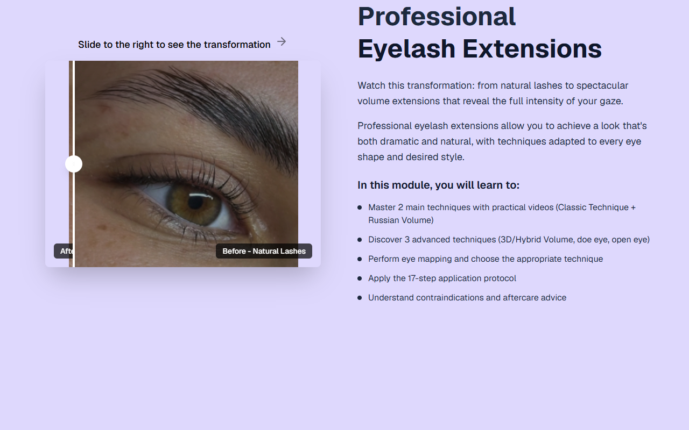

# Intro Slider — Lash Extensions (EN)

**Course:** Lash Extensions (EN)  
**Slide:** 1  
**Live URL:** https://sbsns.edtechiecorp.com  
**Stack:** Next.js · Tailwind CSS · TypeScript · GitHub Pages  

## What this slide does

Opening intro slider for the English-language lash extension course, presenting the course title, learning objectives, and visual examples of professional lash extension styles. This slide establishes the tone of the English curriculum and immediately engages learners by showcasing the level of skill they will achieve upon completion.

## Screenshot

## Usage

This slide is embedded as an iframe inside Coassemble at the live URL above. DNS is managed via Cloudflare (`edtechiecorp.com`). To update the slide, push to the `main` branch — GitHub Actions will rebuild and redeploy automatically.
